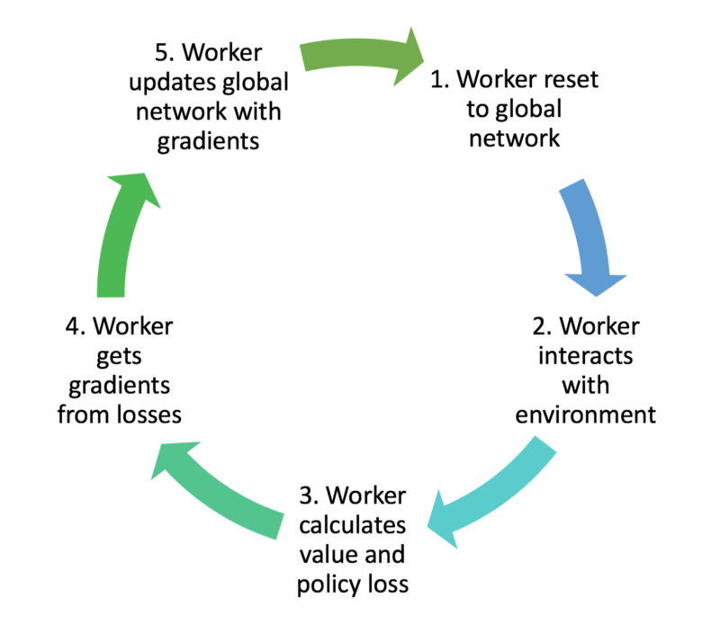

# Reinforcement Learning implementation of LSTM with Asynchronous Advantage Actor Critic Algorithm
## Using Pytorch on OpenAI Atari Games
	Using OpenAi Gym and Universe. 
	LSTM(Long Short Term Memory) with Pytorch
	Implementation of Google Deepmind's Asynchronous Advantage Actor-Critic (A3C)

# Ipython/Jupyter Notebook 
## Environment provided by OpenAI Gym and Universe
	Inputs are changed in the Jupyter Notebook
  
## Asynchronous Advantage Actor-Critic (A3C) Reinforcement Learning Implementation
### Long Short Term Recurrent Neural Network with Pytorch

An algorithm from Google Deep Mind's paper "Asynchronous Methods for Deep Reinforcement Learning." 
https://arxiv.org/pdf/1602.01783.pdf

### Using Google DeepMind's Algorithm. 

Asynchronous Advantage Actor-Critic (A3C)

  
##### Description
The A3C algorithm was released by Google’s DeepMind group earlier this year, and it made a splash by essentially obsoleting DQN. It was faster, simpler, more robust, and able to achieve much better scores on the standard battery of Deep RL tasks. On top of all that it could work in continuous as well as discrete action spaces. Given this, it has become the go-to Deep RL algorithm for new challenging problems with complex state and action spaces

    
<a href= "https://medium.com/emergent-future/simple-reinforcement-learning-with-tensorflow-part-8-asynchronous-actor-critic-agents-a3c-c88f72a5e9f2" >Medium Article explaining A3c reinforcement learning </a>
 

## The Actor-Critic Structure

## Many workers training and learning concurrently, and then updates global network with gradients
### Process Flow

    
### Long Short Term Memory Recurrent Neural Nets
	Implemented using Pytorch
<a href= "http://colah.github.io/posts/2015-08-Understanding-LSTMs/" >Understanding LSTM Post </a>

## Trained models

  Trained models are generated when you run through a full training episode for the sim. Continous running will update the model with new training. The L(Load) parameter is set to false in the demo, When you have trained data where it can pick up from, then set it to true.

*In gym atari the agents randomly repeat the previous action with probability 0.25 and there is time/step limit that limits performance. You can adjust these parameters.*

## Optimizers and Shared optimizers/statistics

#### RMSProp

RMSprop is an unpublished, adaptive learning rate method proposed by Geoff Hinton in Lecture 6e of his Coursera Class.

RMSprop and Adadelta have both been developed independently around the same time stemming from the need to resolve Adagrad's radically diminishing learning rates. RMSprop in fact is identical to the first update vector of Adadelta 

RMSprop as well divides the learning rate by an exponentially decaying average of squared gradients. Hinton suggests γ
to be set to 0.9, while a good default value for the learning rate η is 0.001.

#### Adaptive Moment Estimation (Adam) , Both Shared and non shared available for Adam
is another method that computes adaptive learning rates for each parameter. In addition to storing an exponentially decaying average of past squared gradients vt like Adadelta and RMSprop, Adam also keeps an exponentially decaying average of past gradients mt, similar to momentum:

Adam (short for Adaptive Moment Estimation) is an update to the RMSProp optimizer. In this optimization algorithm, running averages of both the gradients and the second moments of the gradients are used.
	

## Training
It is important to limit number of worker threads to number of cpu cores available in your com.
If you use more than one worker thread than the amount of cpu cores, it will result in poor performance and inefficiency.

